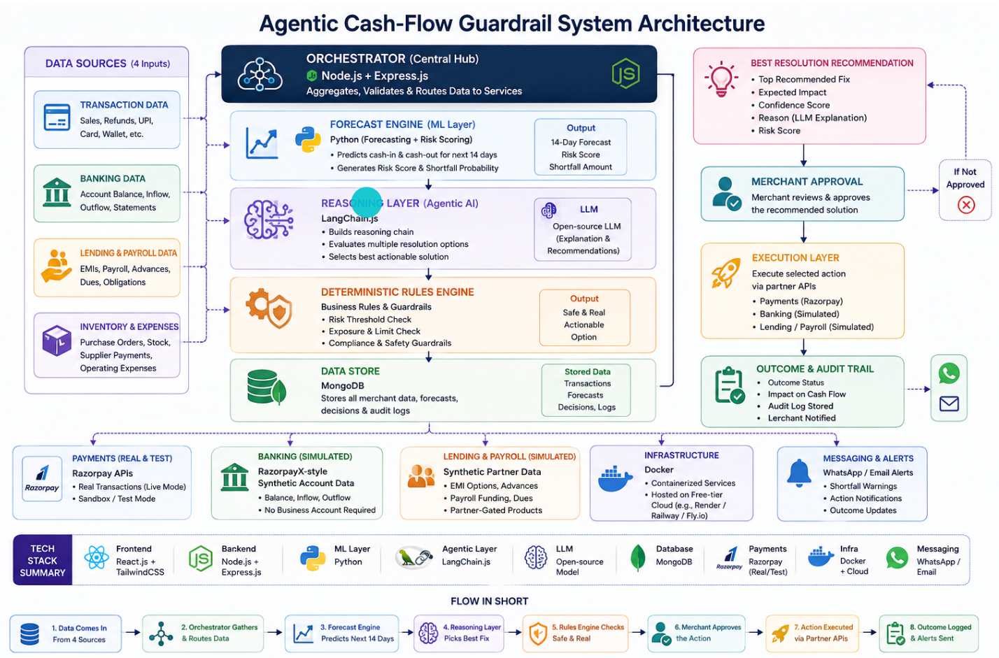

# CashCrunch Autopilot


> **An agentic AI system that watches a small business's sales, bank balance, loan EMIs, and payroll together — predicts cash shortfalls up to 14 days ahead, proposes a bounded cost-labelled fix, and never moves money until the merchant approves.**

Built for the **Razorpay AI Buildathon** by **Om Panchal**.

---

## The Problem

*Why good businesses miss payroll — even when they're doing fine.*

A small business owner selling online gets paid through Razorpay, keeps money in a RazorpayX current account, repays a Razorpay Capital loan, and pays staff through Razorpay Payroll. **All four are Razorpay products — but the owner has no single place that shows if all four numbers will add up on payday.**

| The Gap | The Painful Surprise |
|---|---|
| Payment Gateway, RazorpayX, Capital, and Payroll all work as separate products. None of them talk to each other. A business can have healthy sales and still run out of cash because a loan EMI and a payroll date fall on the same day. | The business owner finds out they are short on cash only when the payroll payment actually fails or bounces. By the time it happens, it is too late to fix cheaply. |

> *"We chose this problem because Razorpay's biggest strength is that it already sits on all four pieces of a business's money life — sales, bank balance, loans, and payroll. Our vision is not to build the flashiest tool, but the most useful one: an AI system that quietly watches the numbers and warns a business before a crisis, not after."*

---

## What is CashCrunch?

CashCrunch Autopilot is a **multi-agent AI system** that continuously monitors all four data streams for each merchant and:

1. **Predicts** the exact day a cash shortfall will happen
2. **Explains** why it is happening in plain language
3. **Suggests** 2–3 specific, low-cost fixes with exact costs
4. **Waits** for the merchant to approve before touching anything
5. **Executes** only the approved action via verified Razorpay features
6. **Re-forecasts** automatically after every action

**The agent never moves money on its own. Every rupee movement requires an explicit human approval.**

---

## System Architecture



### How the pipeline works

```
┌─────────────────────────────────────────────────────────────────┐
│                        AGENTIC AI PIPELINE                       │
│                                                                  │
│  1. Data Agent      → Pulls sales, balance, EMI, payroll data    │
│  2. Forecast Agent  → Projects 14-day cash balance (pandas)      │
│  3. Reasoning Agent → Explains the shortfall, compares fixes     │
│  4. Decision Agent  → Picks cheapest fix, checks compliance      │
│  5. Approval Agent  → Presents to merchant, waits for yes/no     │
│  6. Follow-up Agent → Re-checks numbers weekly, auto re-forecast │
└─────────────────────────────────────────────────────────────────┘
```

### Tech stack

```
/client      React 19 + Vite + Tailwind CSS    — merchant dashboard
/server      Node.js + Express (ES modules)    — orchestration API + MongoDB
/ai-service  Python 3.10 + FastAPI + pandas    — forecasting, recommendations, accuracy
/scripts     Python                            — synthetic data generator (50 merchants)
```

---

## Machine Learning Layer

| Aspect | Implementation |
|---|---|
| **Method** | Day-by-day cash balance projection — rolling average of sales minus known outgoings |
| **Why this method** | Simple, fast, fully explainable — no black box needed for a money decision |
| **Input features** | Daily sales (60-day history), current bank balance, loan EMI date & amount, payroll date & amount |
| **Training / Testing data** | 50 synthetic merchants, with 10–15 deliberately set up to run short of cash |
| **Output** | Predicted shortfall day, shortfall amount, confidence level |
| **Explainability** | Every prediction shows the exact numbers used to reach it |
| **Decision time** | Under one second per merchant |

### Expected model performance

| Metric | Target |
|---|---|
| Shortfall Detection Accuracy | 85%+ |
| False Alarm Rate | Under 15% |
| Average Prediction Lead Time | 5–7 days before shortfall |

### Forecast Model vs Agentic AI

| Forecast Model | Agentic AI |
|---|---|
| Predicts the shortfall | Explains the shortfall in plain language |
| Calculates exact numbers | Understands business context |
| Fast and repeatable | Compares trade-offs between fixes |
| Rule-checked | Talks to the merchant conversationally |

---

## Key Features

| # | Feature | Description |
|---|---|---|
| 1 | **No Manual Bookkeeping** | Uses data Razorpay already has — no spreadsheets or external imports |
| 2 | **Predicts Shortfalls 2 Weeks Ahead** | Helps you plan before it becomes critical |
| 3 | **Explainable Reasoning for Every Alert** | See why the alert is raised and what's driving it |
| 4 | **Merchant Approval Required Before Any Action** | You stay in control at every step — no surprises |
| 5 | **Shows Exact Cost of Every Suggested Fix** | No guessing — just clear numbers |
| 6 | **Weekly Automatic Re-forecast** | Always stays updated with your latest data |
| 7 | **Works for Businesses with No Formal Accounting** | No spreadsheets or complex records needed |
| 8 | **Simple Dashboard** | Red flag on merchants about to run short |
| 9 | **Privacy-First** | Only reads data the merchant already shares with Razorpay |
| 10 | **Built to Scale** | Works for tens of merchants using the same logic |

---

## Impact

### For Small Businesses

| Benefit | Detail |
|---|---|
| **Early Warning** | Know about a cash shortfall 5–7 days before it happens, not on the day it fails |
| **Cheaper Fixes** | Get the lowest-cost option instead of panicking and taking an expensive loan |
| **No Missed Payroll** | Employees get paid on time, protecting trust and morale |

### For Razorpay (indirect revenue gain)

| Benefit | Detail |
|---|---|
| **More Product Usage** | Every suggested fix (like an instant settlement) uses a real Razorpay paid feature |
| **Stronger Merchant Retention** | Merchants who feel protected stay longer on the platform |
| **Cross-Sell Opportunity** | Merchants without a Capital loan or Payroll account may sign up for one after seeing the benefit |

---

## Before vs After

| | Before CashCrunch | After CashCrunch |
|---|---|---|
| **Awareness** | Merchant finds out about the shortfall only when payroll fails | Merchant gets a warning 5–7 days early |
| **Fix** | No warning. No suggested fix. | Sees the cheapest fix with its exact cost |
| **Action** | Lost trust, possible loss of employees | Approves in one tap — payroll goes through on time |
| **Posture** | Reactive. Risky. Costly. | Proactive. Smart. Reliable. |

---

## Business Case & Feasibility

### Cost to implement

| Component | Technology | Estimated Cost |
|---|---|---|
| Forecast Engine | Python (simple math model) | Very Low |
| LLM Reasoning | Open-source / pay-per-token API | Low–Medium |
| Backend APIs | Node.js + Express | Low |
| Database | MongoDB | Pay-as-you-scale |
| Alerts | WhatsApp / Email API | Low (per message) |
| Infra | Free-tier cloud hosting | Low |

### Why this works

- **Uses data Razorpay already collects** — no new data pipeline needed
- **Low technical risk** — the forecast is simple arithmetic, not a complex model
- **Fits directly into the existing merchant dashboard**
- **Missed payroll is a well-known, painful problem for small businesses everywhere**
- Cash flow tools exist for single bank accounts (Float, QuickBooks) but none combine sales + banking + loan + payroll for the same business the way Razorpay's own data can
- **This is a problem only Razorpay is positioned to solve well** — because it already holds all four pieces of data

### Scalability

- The same forecast logic works for 50 merchants or 5 lakh merchants
- Lightweight — no heavy AI compute needed for the core prediction
- LLM is only used for the explanation step, keeping running costs low

---

## Theme Alignment

- **"AI Finance Controller"** — directly matches the brief's own example: a forward cash forecaster
- **"Power of Agentic AI"** — the agent doesn't just calculate a number; it reasons about the best fix, checks it against real rules, and only acts after human approval — like a digital finance assistant

---

## What's Real vs Synthetic

This distinction is enforced in code everywhere it matters with explicit `// SYNTHETIC:` comments.

| Integration | Status | Notes |
|---|---|---|
| **Razorpay Payment Gateway** | ✅ Real test-mode API | Live Razorpay test keys; `razorpay_payment_id` is a real PG object |
| **RazorpayX Payouts** | ⚠️ Synthetic | No public self-serve sandbox without KYC. Models exact Contact + Fund Account + Payout shape including `queued → processing → processed` lifecycle. One-file swap in `server/services/razorpayx.js`. |
| **Razorpay Capital (loans)** | ⚠️ Synthetic | No public sandbox. Loan + EMI data matches Razorpay Capital's documented object shape. |
| **Razorpay Payroll** | ⚠️ Synthetic | No public sandbox. Payroll run data matches the documented shape. |
| **MongoDB** | ✅ Real | Live database; all collections match `PROJECT_BRIEF.md` schema exactly |
| **AI Forecasting** | ✅ Real logic | Genuine pandas-based 14-day cash projection with precision/recall measured against planted ground-truth shortfalls across 50 merchants |

---

## Governance Rule

The AI service (`/ai-service`) may only ever **propose**. It writes to `recommendations` with `status: "pending"` and **never calls a Razorpay payout endpoint**. Only the Express server executes money-moving actions, and only after a recommendation's status is explicitly set to `"approved"` by a human action from the dashboard. This is enforced architecturally — the AI service has no Razorpay credentials.

---

## Money Handling

All monetary values are stored and transmitted as **integer paise** (Razorpay's native unit — 1 rupee = 100 paise). Conversion to ₹ happens only inside the React `formatMoney()` helper at `client/src/utils/formatMoney.js` — nowhere else in the stack.

---

## Running Locally

### Prerequisites

- Node.js 18+
- Python 3.10+
- MongoDB running locally (`mongodb://127.0.0.1:27017`)
- Razorpay test-mode API keys (Payment Gateway only)

### 1. Environment setup

```bash
cp server/.env.example server/.env
cp ai-service/.env.example ai-service/.env
# Fill in MONGODB_URI, RAZORPAY_KEY_ID, RAZORPAY_KEY_SECRET
```

### 2. Start all three services (three terminals)

```bash
# Terminal 1 — AI service
cd ai-service
python -m venv venv && venv\Scripts\activate   # Windows
pip install -r requirements.txt
uvicorn main:app --reload
# → http://localhost:8000

# Terminal 2 — Express server
cd server
npm install && npm run dev
# → http://localhost:5000

# Terminal 3 — React client
cd client
npm install && npm run dev
# → http://localhost:5173
```

### 3. Seed the database

```bash
cd server
node scripts/seed.js
```

Then open `http://localhost:5173`, navigate to any merchant, and click **↻ Forecast** → **✦ Recommend** to generate the first recommendation.

---

## Project Structure

```
/
├── Architecture.png          ← System architecture diagram
├── PROJECT_BRIEF.md          ← Source of truth for schema and field names
├── client/                   ← React dashboard (Vite + Tailwind)
│   └── src/
│       ├── pages/
│       │   ├── LandingPage.jsx     ← Marketing landing page (route: /)
│       │   ├── Dashboard.jsx       ← App shell (route: /app)
│       │   ├── MerchantList.jsx
│       │   ├── MerchantDetail.jsx
│       │   └── AccuracyReport.jsx
│       ├── components/
│       └── utils/formatMoney.js    ← Only place paise → ₹ conversion happens
├── server/                   ← Express API + Razorpay integration
│   ├── models/               ← One Mongoose model per MongoDB collection
│   ├── routes/               ← One router file per resource
│   ├── services/
│   │   ├── razorpay.js       ← All Razorpay PG SDK calls (real)
│   │   └── razorpayx.js      ← RazorpayX layer (SYNTHETIC — one-file swap)
│   └── scripts/seed.js
├── ai-service/               ← Python FastAPI service
│   ├── forecasting/engine.py ← Pure pandas forecasting functions
│   ├── recommendations/agent.py
│   └── reporting/accuracy.py ← Precision / recall against ground truth
└── scripts/
    └── output/
        ├── seed_data.json
        └── ground_truth.json ← 50 merchants, 15 planted shortfalls
```

---

*Built with the Razorpay API · Razorpay AI Buildathon 2026 · Om Panchal*
